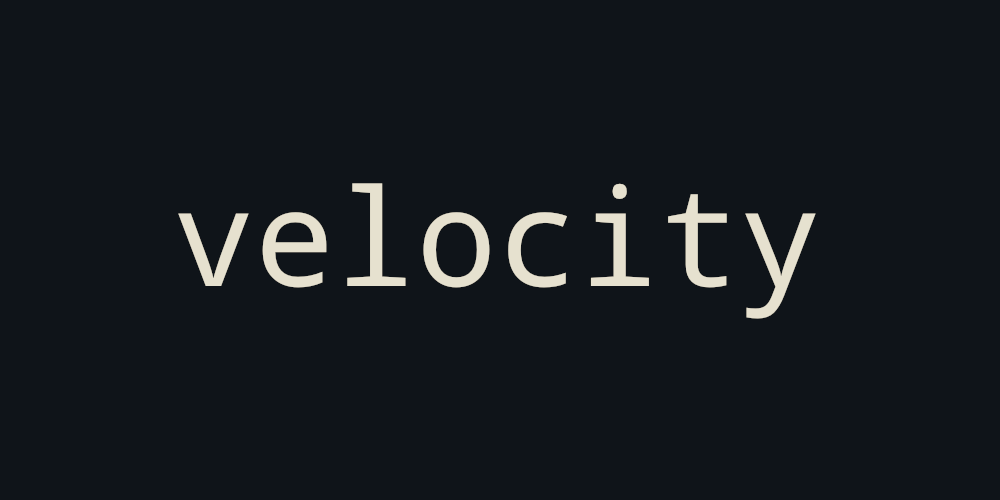

<br>
<a align="center" href="https://discord.gg/ypTKwQU"></a>
<hr />
## velocity-shell
A Linux shell environment written in C++. <br />
"vsh", "vshell" or "Velocity Shell". <br />
<br />
For custom prompts, create a file called "prompt" in the working directory and put something in it. That something will be your new shell prompt<br />

#### Compile Guide
To compile the shell run the command :
```bash
make compile
```
*NOTE*: Run this command inside of dir where vsh is located

